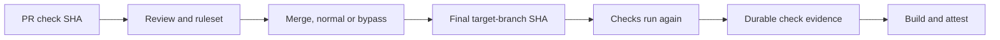
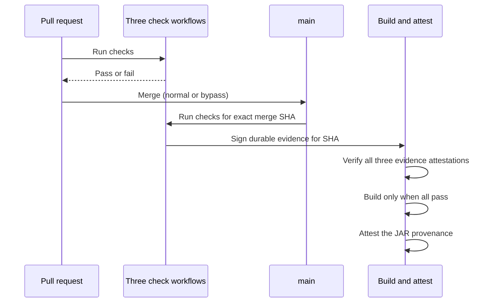

# Attestation Governance Demo

This is a very small Java example.

The app says:

```text
Hello, World!
```

GitHub Actions builds the app and makes a signed note called an **attestation**.
The note helps us check that the JAR file came from this GitHub Actions build.

## What is here?

- `src/main/java/HelloWorld.java` is the Java app.
- `.github/workflows/mock-sonarqube.yml` is the mock SonarQube check.
- `.github/workflows/mock-codeql.yml` is the mock CodeQL check.
- `.github/workflows/mock-test.yml` is the mock test check.
- `.github/workflows/build-and-attest.yml` checks the results, builds the app,
  and attests the JAR.

## Run it on your computer

You need Java 17 or newer.

```bash
javac -d out src/main/java/HelloWorld.java
java -cp out HelloWorld
```

You should see:

```text
Hello, World!
```

## Make the JAR yourself

```bash
mkdir -p build/classes
javac -d build/classes src/main/java/HelloWorld.java
jar --create --file build/hello-world.jar --main-class HelloWorld -C build/classes .
java -jar build/hello-world.jar
```

## What the workflows do

The three mock check workflows run when a PR is opened or updated. They also
run on `main`. When they pass on `main`, each one creates a signed, durable
check-evidence attestation for the exact commit.

The build-and-attest workflow runs in either of two ways:

- GitHub starts it when a PR closes after being merged.
- A person starts it with **Run workflow** and chooses a branch, tag, or commit.

The build-and-attest workflow then:

1. Finds the exact commit to build.
2. Recreates the small evidence files for that commit.
3. Verifies the signed evidence attestations for all three checks.
4. Stops if any evidence is missing or invalid.
5. Builds the JAR from that exact commit.
6. Makes a build provenance attestation for the JAR.
7. Attaches a compliance attestation to the same JAR that lists the checks.

This means a bypass user can merge code with failed PR checks, but that exact
merged commit cannot receive an attested JAR. The later build does not depend
on GitHub's short-lived check-run history.

The build and attestation are two **jobs in one workflow**, not two workflows.
They are separate because attestation must happen only after the JAR exists.
The three checks are separate workflows because that matches the normal PR
model and lets each check appear as its own required status check.

## Why checks run twice

Seeing the three checks run twice is expected.

The first run checks the PR. The second run checks the exact commit that landed
on the target branch. These commits are not always the same:

```text
PR head or test-merge SHA  !=  final target-branch SHA
```

The build must use the second SHA. Otherwise, it could build one commit while
showing check evidence from a different commit.



The second run also handles bypasses:

- If a bypassed merge passes all checks on the final commit, it can receive an
  attested build.
- If a bypassed merge fails any check, it creates no valid evidence and gets no
  attested build.

This is a commit identity problem, not a timing problem. Even if all PR checks
finished before the merge, their result may describe the PR SHA rather than the
final target-branch SHA.

## How merge models change this

The second run is the safest default for normal GitHub merge behavior.

| Merge model | Can the first checks prove the final build? | What it means |
| --- | --- | --- |
| Merge commit | No | The merge creates a new commit. Run checks again. |
| Squash merge | No | Git creates a new squashed commit. Run checks again. |
| Rebase merge | Usually no | The commits can receive new SHAs. Run checks again. |
| Fast-forward only | Sometimes | The PR head SHA can remain unchanged. |
| Merge queue | Sometimes | Checks can run on the exact merge candidate if the queue preserves it. |

The design can be changed to use a merge queue or fast-forward-only policy, but
that is a repository policy choice. This reference workflow does not assume
either policy. It always requires check evidence for the exact commit it will
build.

## Protect the protection

The check workflows and the build gate are part of the security boundary.
Protect them like production code:

- Require review for changes under `.github/workflows/`.
- Do not let normal developers bypass those reviews.
- Prefer a trusted reusable workflow stored in a separate protected repository.
- Keep the required check names and signer workflow identities under administrator
  control.

If a bypass user can change both a check workflow and the build gate, they could
remove the evidence requirement. The attestation proves what the trusted
workflow did, so the workflow itself must be trusted.



The workflow needs special permission to create the attestation:

- `attestations: write` lets it write the attestation.
- `id-token: write` lets GitHub sign the attestation.

The check workflows use `actions/attest@v4` to sign small evidence files. The
build workflow verifies those files later, even after GitHub removes old
workflow check records. It then makes a build provenance attestation for the
JAR.

## Two attestations on the JAR

The finished JAR carries two signed notes:

- **Build provenance**: where the JAR came from (repository, workflow, commit).
- **Compliance record**: which checks passed, using the predicate type
  `https://example.com/attestation/compliance/v1`.

The gate before the build stops bad code from ever becoming a JAR. The
compliance record does something different: it travels with the JAR. Someone
who only has the JAR file, and no access to our workflow logs, can still ask
GitHub which checks passed for it.

Check it like this:

```bash
gh attestation verify hello-world.jar \
  -R OWNER/REPOSITORY \
  --predicate-type https://example.com/attestation/compliance/v1
```

That command only answers "is this signed note real?". It prints a pass or a
fail. It does **not** show the check names.

### Where the check names are actually visible

To read the list of checks, add `--format json` and pull out the predicate:

```bash
gh attestation verify hello-world.jar \
  -R OWNER/REPOSITORY \
  --predicate-type https://example.com/attestation/compliance/v1 \
  --format json \
  --jq '.[].verificationResult.statement.predicate'
```

Example output:

```json
{
  "repository": "OWNER/REPOSITORY",
  "commit": "abc123...",
  "checks": [
    { "name": "mock-sonarqube", "result": "success" },
    { "name": "mock-codeql", "result": "success" },
    { "name": "mock-test", "result": "success" }
  ]
}
```

There are three places to look, in order of how easy they are:

| Where | What you see |
| --- | --- |
| Repository **Attestations** tab | Both notes listed for the JAR, with their predicate types |
| `gh attestation verify --format json` | The full check list, as shown above |
| `gh attestation download` | The raw signed bundle, for offline or archive use |

Both notes are bound to the same thing: the SHA-256 digest of the JAR. That is
why more notes can be added later by other workflows without rebuilding.

The evidence files are deterministic: they contain only the repository, commit,
check name, and `success`. The later workflow can recreate the exact bytes and
verify their SHA and signed attestation.

## Check the attestation

After the workflow finishes, download `hello-world.jar` from the workflow run.
Then run this command with the GitHub CLI:

```bash
gh attestation verify hello-world.jar -R OWNER/REPOSITORY
```

Replace `OWNER/REPOSITORY` with the real repository name.

If the command says the attestation is valid, the JAR has a trusted build story.
In this reference design, that provenance attestation is only created after the
build workflow verifies all required check evidence.

